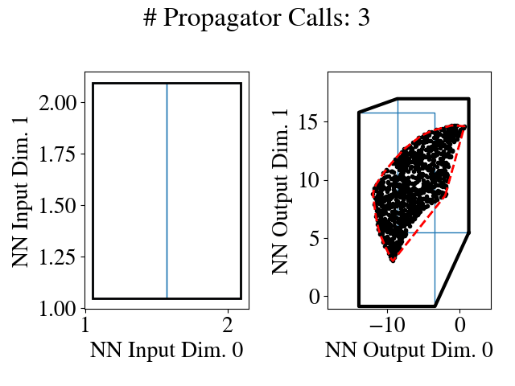

### About

This repository provides Python implementations for the robustness analysis tools in some of our recent papers.

#### `nn_partition`

* Michael Everett, Golnaz Habibi, Jonathan P. How, ["Robustness Analysis of Neural Networks via Efficient Partitioning with Applications in Control Systems"](https://doi.org/10.1109/LCSYS.2020.3045323), IEEE LCSS 2020 & ACC 2021.

We introduce the concepts of `Analyzer`, `Propagator`, and `Partitioner` in our LCSS/ACC '21 paper and implement several instances of each concept as a starting point.
This modular view on NN robustness analysis essentially defines an API that decouples each component.
This decoupling enables improvements in either `Propagator` or `Partitioner` algorithms to have a wide impact across many analysis/verification problems.



#### `nn_closed_loop`

* Michael Everett, Golnaz Habibi, Jonathan P. How, ["Efficient Reachability Analysis for Closed-Loop Systems with Neural Network Controllers"](https://arxiv.org/pdf/2101.01815.pdf), ICRA 2021 (in review).

Since NNs are rarely deployed in isolation, we developed a framework for analyzing closed-loop systems that employ NN control policies.
The `nn_closed_loop` codebase follows a similar API as the `nn_partition` package, leveraging analogous `ClosedLoopAnalyzer`, `ClosedLoopPropagator` and `ClosedLoopPartitioner` concepts.
The typical problem statement is: given a known initial state set (and a known dynamics model), compute bounds on the reachable sets for N steps into the future.
These bounds provide a safety guarantee for autonomous systems employing NN controllers, as they guarantee that the system will never enter parts of the state space outside of the reachable set bounds.

---

We build on excellent open-source repositories from the neural network analysis community. These repositories are imported as Git submodules or re-implemented in Python here, with some changes to reflect the slightly different problem statements:
* [`auto_LIRPA`](https://github.com/KaidiXu/auto_LiRPA)
* [`crown_ibp`](https://github.com/huanzhang12/CROWN-IBP)
* [`robust_nn`](https://github.com/arobey1/RobustNN)
* [`nnv`](https://github.com/verivital/nnv)

### Get the code

```bash
git clone --recursive <this_repo>
```

### Install

Create a `virtualenv` for this repo:
```bash
python -m virtualenv venv
source venv/bin/activate
```

Install the various python packages in this repo:
```bash
python -m pip install -e crown_ibp 
python -m pip install -e auto_LiRPA
python -m pip install -e robust_sdp
python -m pip install -e nn_partition
python -m pip install -e nn_closed_loop
```

You're good to go!

### Simple Examples

Try running a simple example where the Analyzer computes bounds on the NN output (given bounds on the NN input):
```bash
python -m nn_partition.example \
	--partitioner GreedySimGuided \
	--propagator CROWN_LIRPA \
	--term_type time_budget \
	--term_val 2 \
	--interior_condition lower_bnds \
	--model random_weights \
	--activation relu \
	--show_input --show_output --show_plot
```

Or, compute reachable sets for a closed-loop system with a pre-trained NN control policy:
```bash
python -m nn_closed_loop.example \
	--partitioner None \
	--propagator CROWN \
	--system double_integrator_mpc \
	--state_feedback \
	--t_max 5 \
	--show_plot
```

### Replicate plots from the papers:

* LCSS/ACC '21: [README](docs/_static/lcss21/lcss21.md)
* ICRA '21 (submission): [README](docs/_static/icra21/icra21.md)

### If you find this code useful, please consider citing:
For the partitioning-only code (LCSS/ACC '21):
```
@article{everett2020robustness,
  title={Robustness Analysis of Neural Networks via Efficient Partitioning with Applications in Control Systems},
  author={Everett, Michael and Habibi, Golnaz and How, Jonathan P},
  journal={IEEE Control Systems Letters},
  year={2020},
  publisher={IEEE},
  doi={10.1109/LCSYS.2020.3045323}
}
```

For the closed-loop system analysis code (ICRA '21 subm.):
```
@inproceedings{Everett21_ICRA,
    Author = {Michael Everett and Golnaz Habibi and Jonathan P. How},
    Booktitle = {IEEE International Conference on Robotics and Automation (ICRA)},
    Title = {Efficient Reachability Analysis for Closed-Loop Systems with Neural Network Controllers},
    Year = {2021},
    Pages = {(in review)},
    Url = {https://arxiv.org/pdf/2101.01815.pdf},
    }
```

### TODOS:

- [x] Choices in analyzer argparse
- [x] move partitioners, propagators to separate dirs
- [x] move cartpole, pend, quadrotor files elsewhere
- [x] move MNIST data to right place
- [x] merge in closed_loop branch
- [x] Fig 3b individual images
- [x] Fig 3a individual table
- [x] Replicate LCSS Fig 4
- [x] Replicate LCSS Fig 5
- [x] Replicate LCSS Fig 6
- [x] Replicate ICRA Fig 3b individuals + table
- [x] Replicate ICRA Fig 4b individuals
- [x] Replicate ICRA Fig 5
- [x] publish crown_ibp, auto-Lirpa forks
- [x] setup ci and simple tests to run the various expts
- [x] add citation to papers, add description of repo to top of readme
- [x] add license & copyright?
- [x] get animation working for LCSS
- [ ] get animation working for ICRA
- [ ] setup sync with github

Someday soon...
- [ ] add rtdocs (auto-fill code snippets from test files)
- [ ] track down trained model for Fig 4b
- [ ] LCSS Fig 8
- [ ] Replicate LCSS Table 6b
- [ ] Replicate LCSS Table I
- [ ] ICRA Fig 3 as single script
- [ ] ICRA Fig 3c make pkl
- [ ] ICRA Fig 3c from pkl
- [ ] ICRA Fig 4a make pkl
- [ ] ICRA Fig 4a from pkl
- [ ] ICRA Fig 4b as single script
- [ ] ICRA Fig 4b load correct model
- [ ] ICRA Fig 5 axes names & spacings

